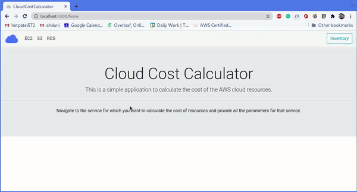

# Task

Eneza Education DevOps Engineer - Technical Challenge
The task requires that I provision a node.js app of my choosing.

# devops-test-21

This project consumes AWS pricing APIs to fetch various pricing information related to AWS products. It then uses these information to give approximate estimate of their AWS resource costs. 


## Demo



## Development server

Run `ng serve` for a dev server. 
Run `ng serve --ssl` to run localhost on https
Navigate to `http://localhost:4200/`. 
The app will automatically reload if you change any of the source files. (See [configure](#configure))

## Code Scaffolding
Run `ng generate component component-name` to generate a new component. You can also use `ng generate directie|pipe|service|class|guard|interface|enum|module`


## Setup and Configuration 
In order to use this application you have to generate an IAM user (Programmatic access for API use) with AWSPriceListServiceFullAccess policy attached ([more info here](https://docs.aws.amazon.com/IAM/latest/UserGuide/id_users_create.html#id_users_create_console)).

After generation of the user, you will get access key and a secret key which will be used to access AWS Price List API. Run the following command to inject those tokens in code:

```bash
$ ./add_creds.sh <access token> <secret token>
```
> Note: Escape the special characters (precede char with \\) while supplying the parameters in above command.

To clear those tokens from the code run `./add_creds.sh clear`.

##  Running unit tests
Run `ng test` to execute the unit tests via ([Karma](https://www.softwaretestinghelp.com/karma-test-runner-tutorial/))

## Running end-to-end tests
Run `ng e2e` to execute the end-to-end tests via ([Protractor](https://www.protractortest.org/#/))

### Docker
```bash
$ # Build
$ docker build -t devops-test-21 .
$ # Run
$ docker run -d -p 8080:80 devops-test-21
```

### Static Deployment files
```bash
$ npm install
$ ng build --prod
```
This will produce ./dist/devops-test-21 directory which contains javascript bundles and all static files which can be hosted on server.

## Ansible

This project contains ansible playbook with roles (See readme files inside ansible/roles/rolename for more info) to create aws resources and to automatically deploy this application on created server instance.

### Build & Configure
```bash
$ npm install
$ ng build --prod --output-path ansible/roles/app-server/files/devops-test-21/
```

To run the ansible playbook you will need to configure aws keys for ansible. So for that go to groupvars dir `cd group_vars/all`. Then create a vault (delete existing file) for your aws keys `ansible-vault create aws_creds`. Enter following in the vault file:
```
---
aws_access_key: <your access key>
aws_secret_key: <your secret key>
```
Then create a pass.txt and enter your password in that file OR you can use --ask-vault-pass while running your palybook.

### Deploy
```bash
$ ansible-playbook site.yml
```

This will create your AWS resources (Public VPC, Subnet, IGW, EC2 instances) and also deploy the application on that instance.


### TODO
Configure Automation and Orchestation using Jenkins
Configure Orchestation using Kubernetes or Mesos 


### Further help
To get more help on Angular CLI use `ng help` or go check out the([Amgular CLI README](https://github.com/angular/angular-cli/blob/master/README.md))

### Done and Documented by:
Nixon Chebii
Email: chebiinixon91@gmail.com
